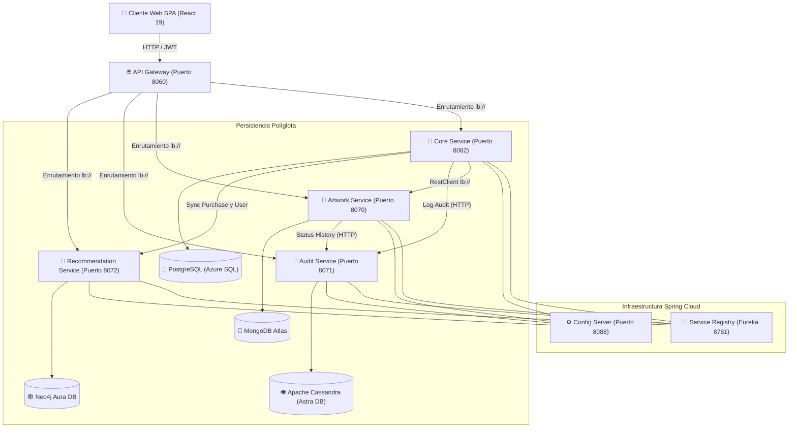
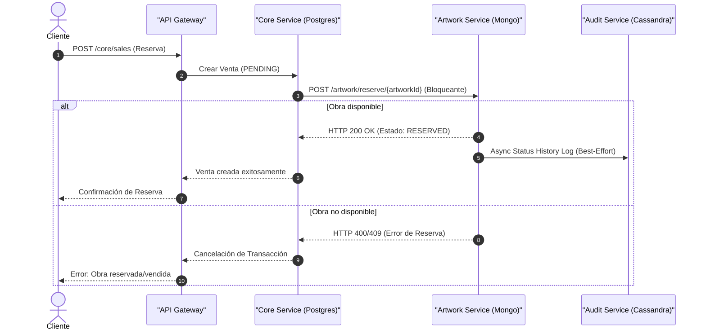

# 🎨 Pictorial Arcane — Plataforma de Microservicios & Persistencia Políglota

> **Sistema distribuido de gestión de galería de arte, comercio electrónico, analítica auditada y recomendación basada en grafos e inteligencia artificial.**

[](https://www.oracle.com/java/)
[](https://spring.io/projects/spring-boot)
[](https://spring.io/projects/spring-cloud)
[](https://www.postgresql.org/)
[](https://www.mongodb.com/)
[](https://www.datastax.com/products/datastax-astra)
[](https://neo4j.com/)
[](https://www.docker.com/)
[](https://react.dev/)
[](https://vitejs.dev/)

---

## 📌 Tabla de Contenidos
1. [Visión General del Proyecto](#-visión-general-del-proyecto)
2. [Puntos Destacados para Ingenieros y Reclutadores](#-puntos-destacados-para-ingenieros-y-reclutadores)
3. [Ecosistema Tecnológico](#-ecosistema-tecnológico)
4. [Arquitectura del Sistema](#-arquitectura-del-sistema)
5. [Especialización de la Persistencia Políglota (4 Bases de Datos)](#-especialización-de-la-persistencia-políglota-4-bases-de-datos)
6. [Catálogo de Microservicios](#-catálogo-de-microservicios)
7. [Mecanismos y Flujos Distribuidos](#-mecanismos-y-flujos-distribuidos)
8. [Seguridad y Control de Acceso (JWT)](#-seguridad-y-control-de-acceso-jwt)
9. [Frontend SPA (Dashboard React + Chart.js)](#-frontend-spa-dashboard-react--chartjs)
10. [Consistencia y Datos de Prueba (Seed Coherente)](#-consistencia-y-datos-de-prueba-seed-coherente)
11. [Guía de Instalación y Despliegue](#-guía-de-instalación-y-despliegue)
12. [Enrutamiento API Gateway & Swagger UI](#-enrutamiento-api-gateway--swagger-ui)
13. [Decisiones Arquitectónicas y Mejoras Futuras (Saga Pattern)](#-decisiones-arquitectónicas-y-mejoras-futuras-saga-pattern)

---

## 🚀 Visión General del Proyecto

**Pictorial Arcane** es una solución tecnológica integral diseñada para transformar la gestión comercial, catalogación de obras, auditoría temporal y recomendación personalizada en galerías de arte de alto nivel.

El proyecto rompe con el monolito tradicional dividiendo el dominio en **7 microservicios independientes** coordinados bajo una arquitectura Cloud Native basada en **Spring Cloud**. Además, implementa **Persistencia Políglota (Polyglot Persistence)**, donde cada servicio utiliza el paradigma de base de datos óptimo para sus requisitos particulares (Relacional, Documental, Columnar e In-Memory / Grafos).

---

## 🛠️ Ecosistema Tecnológico

### Backend (Java / Spring Ecosystem)
- **Lenguaje**: Java 21 LTS
- **Core Framework**: Spring Boot 3.4.x / 4.x
- **Microservices Orchestration**: Spring Cloud (Eureka Server, Spring Cloud Gateway, Spring Cloud Config, Spring Cloud LoadBalancer)
- **Seguridad**: Spring Security + JJWT (JSON Web Token)
- **Acceso a Datos**: Spring Data JPA / Hibernate, Spring Data MongoDB, Spring Data Cassandra, Spring Data Neo4j
- **Integración AI**: Spring AI (Vector Store Neo4j, OpenAI Advisor)
- **Documentación & Swagger**: Springdoc OpenAPI UI 2.8+

### Bases de Datos (Polyglot Persistence)
- **PostgreSQL**: Base de datos relacional (Azure SQL / Local)
- **MongoDB Atlas**: Base de datos orientada a documentos
- **DataStax Astra DB (Apache Cassandra)**: Base de datos NoSQL columnar distribuida
- **Neo4j Aura DB**: Base de datos orientada a grafos

### Frontend & Herramientas
- **Frontend SPA**: React 19, Vite 6, React Router DOM v7, Chart.js, React-ChartJS-2, Lucide Icons, Axios, React Toastify
- **DevOps & Tooling**: Docker, Docker Compose, Maven, Git, Insomnia/Postman

---

## 🏛️ Arquitectura del Sistema



---

## 🗄️ Especialización de la Persistencia Políglota (4 Bases de Datos)

En lugar de forzar una única base de datos para todas las necesidades, el dominio se ha dividido estratégicamente entre 4 motores de datos:

| Base de Datos | Tipo | Servicio Responsable | Justificación Técnica & Casos de Uso |
|---|---|---|---|
| **PostgreSQL** | Relacional (ACID) | `core-service` | Garantiza transacciones estrictas e integridad referencial para Usuarios, Perfiles de Clientes, Ventas, Pagos y Membresías. |
| **MongoDB Atlas** | Documental (NoSQL) | `artwork-service` | Proporciona flexibilidad sintáctica y esquemas dinámicos para catalogar Obras de Arte, Artistas y Géneros con búsquedas eficientes por atributos. |
| **Apache Cassandra (Astra DB)** | Columnar (NoSQL) | `audit-service` | Optimizado para alta velocidad de escritura inmutable y consultas por rango de fechas (Series de Tiempo) en logs de auditoría, seguridad e historial de facturación mensual. |
| **Neo4j Aura DB** | Grafos & Vector AI | `recommendation-service` | Modela conexiones complejas entre Compradores, Obras vistas y Artistas favoritos para generar motores de recomendación por similitud y vectores Spring AI. |

---

## 📦 Catálogo de Microservicios

| Servicio | Puerto | Rol Arquitectónico | Persistencia | Funcionalidades Clave |
|---|---|---|---|---|
| `service-registry` | `8761` | Eureka Server | — | Descubrimiento de servicios dinámico y registro heartbeat. |
| `config-server` | `8088` | Config Centralizada | — | Servidor de configuración unificada para entornos de dev y prod. |
| `api-gateway` | `8060` | Puerta de Entrada | — | Routing unificado, `StripPrefix`, balanceo de carga y punto de entrada al sistema. |
| `core-service` | `8082` | Dominio Principal & Auth | PostgreSQL | Gestión de usuarios, roles, clientes, ventas, pagos, membresías, emisión de JWT y tareas cron de expiración de reservas. |
| `artwork-service` | `8070` | Catálogo de Arte | MongoDB | Gestión de obras, artistas y géneros. Generación de secuencias numéricas de negocio (`artworkId`) e inmunidad a duplicados. |
| `audit-service` | `8071` | Auditoría & Logs | Cassandra (Astra) | Registro histórico inmutable de facturación mensual, cambios de estado de obras y auditoría de seguridad/logins. |
| `recommendation-service` | `8072` | Recomendaciones AI | Neo4j Aura DB | Motor de análisis de comportamiento, tendencias de compra, obras más populares e integración con Spring AI. |
| `security-commons` | — | Librería Compartida | — | Módulo Java que encapsula filtros JWT, decodificación de tokens y seguridad Spring Security para consumo transversal. |

---

## 🔄 Mecanismos y Flujos Distribuidos

### 1. Clave de Negocio Compartida (`artworkId` vs ObjectId)
Las obras en MongoDB poseen un identificador nativo `_id` de tipo `ObjectId` (`String`). Para mantener compatibilidad relacional (`Long`) con `core-service` y `audit-service`, `artwork-service` integra un **SequenceGeneratorService** que produce una clave de negocio numérica secuencial `artworkId` (`Long`).

### 2. Flujo de Reserva y Venta de Obras


### 3. Transiciones de Estado y Políticas de Llamada

| Origen → Destino | Acción | Transición de Estado | Naturaleza de la Llamada |
|---|---|---|---|
| `core-service` → `artwork-service` | Reservar Obra (`reserveArtWork`) | `AVAILABLE` → `RESERVED` | **Bloqueante** (Si falla, cancela la venta) |
| `core-service` → `artwork-service` | Confirmar Venta (`confirmSale`) | `RESERVED` → `SOLD` | *Best-effort* (Log de fallo) |
| `core-service` → `artwork-service` | Rechazar/Expirar 24h (`releaseArtwork`) | `RESERVED` → `AVAILABLE` | *Best-effort* (Liberación en background) |
| `artwork-service` → `audit-service` | Cambio de estado de obra | Registra en `artwork_status_history` | *Best-effort* |
| `core-service` → `audit-service` | Facturar venta | Registra en `billing_by_month` | *Best-effort* |
| `core-service` → `audit-service` | Login exitoso | Registra en `security_log_by_event` | *Best-effort* |

---

## 🔐 Seguridad y Control de Acceso (JWT)

El sistema utiliza autenticación basada en **JSON Web Tokens (JWT)**:
- **Autenticación**: `core-service` procesa el login (`/auth/login`), verifica credenciales con BCrypt y emite el JWT conteniendo los roles del usuario (`ROLE_ADMIN`, `ROLE_CLIENT`).
- **Autorización Distribuida**: A través de `security-commons`, cualquier microservicio valida el token de forma autónoma (Stateless) y aplica las anotaciones `@PreAuthorize("hasRole('ADMIN')")` o `@PreAuthorize("isAuthenticated()")`.

---

## 🖥️ Frontend SPA (Dashboard React + Chart.js)

Ubicado en el directorio [`frontend/`](./frontend), ofrece una interfaz moderna e interactiva:
- **Panel Administrativo**: Gráficos analíticos de facturación mensual y resumen de ventas usando `Chart.js`.
- **Catálogo de Arte**: Exploración con filtros dinámicos por géneros y artistas.
- **Gestión de Membresías & Reservas**: Flujo completo para usuarios registrados.
- **Stack**: React 19, Vite, React Router v7, Axios con Interceptores JWT y Toast Notifications.

---

## 📑 Consistencia y Datos de Prueba (Seed Coherente)

Para facilitar la evaluación técnica, el sistema incluye scripts de inicialización de datos con **coherencia referencial cruzada**:

1. **Relacional (`core-service/src/main/resources/data.sql`)**: Precarga automáticamente usuarios, clientes, ventas e historial 2015-2026.
2. **MongoDB (`artwork-service/scripts/mongo-seed.js`)**: Crea 10 géneros, 80 artistas y **1,000 obras**, alineando los estados (`SOLD`, `RESERVED`, `AVAILABLE`) con las ventas registradas en SQL.
3. **Cassandra (`audit-service/scripts/cassandra-seed.cql`)**: Semilla de auditoría con más de 1,000 registros históricos de facturación, transiciones y eventos de seguridad.

### 🔑 Credenciales de Prueba por Defecto

> [!TIP]
> Todos los usuarios precargados en el script `data.sql` comparten credenciales estandarizadas para agilizar las pruebas.

| Rol | Email / Usuario | Contraseña | Código de Seguridad (Reservas) |
|---|---|---|---|
| **Administrador** | `admin@pictorialarcane.com` | `Test1234` | `123456` |
| **Cliente Ejemplo** | `maria.gonzalez@mail.com` | `Test1234` | `123456` |
| **Usuarios Generales** | *(Cualquier email de `data.sql`)* | `Test1234` | `123456` |

---

## ⚡ Guía de Instalación y Despliegue

### Requisitos Previos
- **Java 21 JDK** instalado y variable `JAVA_HOME` configurada.
- **Node.js 20+** y `npm` (para el frontend).
- **Docker Desktop** (opcional pero recomendado para despliegue global).

---

### Opción A: Despliegue con Docker Compose (Recomendado)

1. **Clonar el repositorio**:
   ```bash
   git clone https://github.com/josmer-azocar/pictorial-arcane-microservices.git
   cd pictorial-arcane-microservices/Microservicios
   ```

2. **Levantar la arquitectura completa de microservicios**:
   ```bash
   docker compose up -d --build
   ```

3. **Iniciar el Frontend SPA**:
   ```bash
   cd ../frontend
   npm install
   npm run dev
   ```

---

### Opción B: Inicio Manual por Microservicio

Si prefieres ejecutar cada servicio en tu entorno local:

1. **Levantar PostgreSQL local (opcional si no usas instancia en la nube)**:
   ```bash
   docker compose up -d
   ```

2. **Ejecutar en orden estratégico** (esperar a que Eureka finalice su inicialización):

```bash
# Terminal 1 - Eureka Registry (Port 8761)
cd Microservicios/service-registry && ./mvnw spring-boot:run

# Terminal 2 - Config Server (Port 8088)
cd Microservicios/config-server && ./mvnw spring-boot:run

# Terminal 3, 4, 5, 6 - Servicios de Negocio (en cualquier orden)
cd Microservicios/core-service && ./mvnw spring-boot:run
cd Microservicios/artwork-service && ./mvnw spring-boot:run
cd Microservicios/audit-service && ./mvnw spring-boot:run
cd Microservicios/recommendation-service && ./mvnw spring-boot:run

# Terminal 7 - API Gateway (Port 8060)
cd Microservicios/api-gateway && ./mvnw spring-boot:run
```

*(En Windows, utilizar `mvnw.cmd` en lugar de `./mvnw`)*.

---

## 🗺️ Enrutamiento API Gateway & Swagger UI

Todo el tráfico externo es centralizado a través de **API Gateway (Port 8060)**:

| Prefijo de Ruta | Microservicio Destino | Descripción / Operaciones |
|---|---|---|
| `/core/**` | `core-service` | Autenticación, Usuarios, Clientes, Ventas, Pagos y Membresías. |
| `/artwork/**`, `/artist/**`, `/genre/**` | `artwork-service` | Catálogo de Obras, Artistas, Géneros y Reserva de Obras. |
| `/artwork-status-history/**`, `/billing-by-month/**`, `/security-log-by-event/**` | `audit-service` | Consultas de auditoría, facturación e historial. |
| `/api/v1/recommendations/**` | `recommendation-service` | Recomendaciones personalizadas, tendencias y similitudes. |

### 🔍 Documentación Interactive Swagger / OpenAPI
- **Core Service Swagger UI**: `http://localhost:8082/swagger-ui/index.html`
- **Eureka Dashboard**: `http://localhost:8761`

